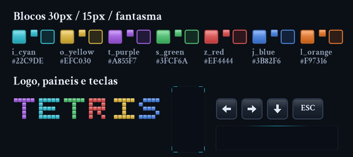

# Assets

Conjunto gráfico do jogo. Tudo é gerado por código com
[`tools/generate_assets.ps1`](../tools/generate_assets.ps1), pelo que a paleta e o
estilo se afinam num sítio só e voltam a sair todos coerentes:

```bash
powershell -ExecutionPolicy Bypass -File tools/generate_assets.ps1
```

As medidas seguem a grelha usada no `Game.cpp` (`PIECE_SIZE 30`,
`NEXT_PIECE_SIZE 15`, tabuleiro 10x20, janela 1280x760), por isso desenham-se
sem escalar.



## Paleta

| Ficheiro   | Peça | Cor       |
| ---------- | ---- | --------- |
| `i_cyan`   | I    | `#22C9DE` |
| `o_yellow` | O    | `#EFC030` |
| `t_purple` | T    | `#A855F7` |
| `s_green`  | S    | `#3FCF6A` |
| `z_red`    | Z    | `#EF4444` |
| `j_blue`   | J    | `#3B82F6` |
| `l_orange` | L    | `#F97316` |

## Inventário

| Caminho                        | Tamanho   | Para que serve                                                       |
| ------------------------------ | --------- | -------------------------------------------------------------------- |
| `images/blocks/<cor>.png`      | 30x30     | Blocos do tabuleiro                                                  |
| `images/blocks/small/<cor>.png`| 15x15     | Blocos do painel das próximas peças                                  |
| `images/blocks/ghost/<cor>.png`| 30x30     | Pré-visualização da posição de queda                                 |
| `images/blocks/atlas.png`      | 210x30    | Os 7 blocos em fila (ordem da tabela acima), para uso como atlas     |
| `images/blocks/red.png`        | 30x30     | Alias de `z_red`, com o nome que o código já usa                     |
| `images/blocks/green.png`      | 30x30     | Alias de `s_green`                                                   |
| `images/blocks/lightblue.png`  | 30x30     | Alias de `i_cyan`                                                    |
| `images/blocks/orange.png`     | 30x30     | Alias de `l_orange`                                                  |
| `images/ui/panel_board.png`    | 300x600   | Fundo do tabuleiro, com grelha de 30px                               |
| `images/ui/panel_next.png`     | 135x270   | Fundo do painel das próximas peças                                   |
| `images/ui/panel_overlay.png`  | 500x200   | Caixa de *Paused* / *Game Over*                                      |
| `images/ui/grid_cell.png`      | 30x30     | Célula da grelha, se preferires desenhar célula a célula             |
| `images/background.png`        | 1280x760  | Fundo da janela                                                      |
| `images/logo.png`              | 610x180   | Logótipo do menu (centrado a `x = 335`, como o `Menu.cpp` já desenha) |
| `images/logo@2x.png`           | 1220x360  | Mesmo logótipo em 2x, para README e divulgação                        |
| `images/keys/key_*.png`        | 44x44     | Teclas: setas, `A`, `D`, `S`, `Q`, `E`                               |
| `images/keys/key_esc.png`      | 64x44     | Tecla `ESC`                                                          |
| `images/keys/key_space.png`    | 148x44    | Barra de espaços                                                     |

Os ficheiros antigos (`red.bmp`, `green.bmp`, `lightblue.bmp`, `orange.bmp`,
`tetrisLogo.png`) ficaram onde estavam — nada deixa de funcionar por causa
destes assets novos.

## Como usar

Os aliases existem para que a troca seja só o caminho do ficheiro. No
`Game.cpp`:

```cpp
m_Red    = m_Renderer->LoadTexture("./assets/images/blocks/red.png");
m_Green  = m_Renderer->LoadTexture("./assets/images/blocks/green.png");
m_Blue   = m_Renderer->LoadTexture("./assets/images/blocks/lightblue.png");
m_Orange = m_Renderer->LoadTexture("./assets/images/blocks/orange.png");
```

A partir daí valem a pena três passos, por ordem de impacto visual:

1. **Fundo e painéis.** Desenhar `background.png` em (0, 0), `panel_board.png` em
   (`BOARD_TOP_LEFT_X_POS`, `BOARD_TOP_LEFT_Y_POS`) e `panel_next.png` no
   `topLeftXPos` que o `DrawNextPiecesBoard()` já calcula. Com o painel a trazer a
   grelha desenhada, o `RenderRect` por célula no fim do `DrawBoard()` deixa de ser
   preciso e o tabuleiro fica bastante mais limpo.
2. **Fantasma.** Trocar o `RenderRect` do `DrawPiecePreviewedPosition()` pela
   textura correspondente em `blocks/ghost/`.
3. **Painel das próximas peças.** Usar as texturas de `blocks/small/`, que são
   desenhadas a 15px em vez de reduzidas a partir dos 30px.

O `panel_overlay.png` tem exactamente os 500x200 do `RenderRect` que o
`DrawOnPause()` e o `DrawGameOver()` já usam, por isso entra sem mexer nas
posições.

Para dar cor própria às sete peças em vez das quatro actuais, basta o `../enums/Color.h`
passar a ter uma entrada por peça e o `Piece.cpp` derivar a cor da forma em vez
de a sortear — os ficheiros já estão todos lá.
